# Star_schema_PB — Power BI star-schema (referentie)

*Auteur: data team · doelgroep: Power BI team*

Dit document beschrijft het ster-schema voor het MRR Power BI semantisch model:
welke fact tables, welke dimensies, welke relaties, welke measures in DAX horen
en welke niet. Alle objecten verwijzen naar bestaande Fabric Warehouse views.

Leidende regel: **Fabric = logica en waarheid · Power BI = presentatie**.
MoM-logica, status en MRR-bedragen worden niet in DAX herbouwd — ze komen
rechtstreeks uit de Gold views.

---

## 1. Fabric-objecten

Alle facts en dims zijn beschikbaar als view in de Fabric Warehouse onder schema `dbo`.

### Fact-bronnen (Gold)

| Fabric view | Grain |
|-------------|-------|
| `gld_subscription_month_status` | subscription × maand |
| `gld_subscription_month_invoice_bridge` | subscription × maand × invoice |
| `gld_subscription_month_rule_context` | subscription × maand × invoicedetail |
| `gld_subscription_month_finance_context` | subscription × maand × invoicedetail × Lucanet-posting |
| `gld_subscription_month_decision` | subscription × maand × signaal_nr |

### Dimensies

| Fabric view | Grain (PK) |
|-------------|------------|
| `dim_date` | `mrr_month_key` (YYYYMM) |
| `dim_subscription` | `subscriptionid` |
| `dim_billing_contract` | `billingcontractid` |
| `dim_invoice` | `invoiceid` |
| `dim_signaal` | `signaal_nr` (1–8) |

---

## 2. Facts

Naamgeving in Power BI volgt `fact_*`-conventie; de onderliggende Fabric-view blijft de gold view.

| Power BI fact | Bron (Fabric) | Grain | Belangrijkste meetwaarden |
|---------------|---------------|-------|---------------------------|
| `fact_subscription_month` | `gld_subscription_month_status` | subscription × maand | `current_mrr`, `previous_mrr`, `mrr_verschil`, `mrr_verschil_pct`, `dataverse_mrr`, status, 8 signaal-flags |
| `fact_subscription_month_invoice` | `gld_subscription_month_invoice_bridge` | + invoice | `lucanet_mrr_amount`, `dataverse_mrr_amount`, `lucanet_posting_count`, `gb_nummers` |
| `fact_subscription_month_rule` | `gld_subscription_month_rule_context` | + invoicedetail | `totalamountexvat`, `is_correctie` |
| `fact_subscription_month_finance` | `gld_subscription_month_finance_context` | + Lucanet posting | `lucanet_postingvalue` (raw), `gb_nummer`, `lucanet_posting_count` (context) |
| `fact_subscription_month_decision` | `gld_subscription_month_decision` | subscription × maand × signaal_nr | `decision`, `decided_by`, `decided_at`, `triggered_count` |

### Aggregatie-regel voor `fact_subscription_month_finance`

`lucanet_posting_count` is op deze grain een **context-kolom**, geen sommeerbare measure
(window-function die zich herhaalt per posting binnen een invoicedetail). Aggregatie in
Power BI alleen via `MAX`, `MIN` of `COUNT DISTINCT` — nooit `SUM`.

`lucanet_postingvalue` is wel SUM-veilig: één rij per Lucanet-posting.

---

## 3. Dimensies — kolommen

### 3.1 `dim_date`

| Kolom | Type | Bron |
|-------|------|------|
| `mrr_month_key` (PK) | INT (YYYYMM) | berekend |
| `mrr_month` | DATE | eerste dag van de maand |
| `year` | INT | |
| `quarter` | INT | |
| `month_name` | VARCHAR(20) | NL-locale ("april") |
| `is_current_month` | BIT | |

Range: jan 2024 – dec 2027.

### 3.2 `dim_subscription`

| Kolom | Type | Bron |
|-------|------|------|
| `subscriptionid` (PK) | VARCHAR(50) | `work365_subscription.work365_subscriptionid` |
| `subscription_name` | NVARCHAR(200) | `work365_subscription.work365_subscription_subscriptionname` |
| `billingcontractid` | VARCHAR(50) | huidige BC (snapshot) |
| `is_actief_huidig` | BIT | |
| `startdate` | DATE | |
| `deactivateon` | DATE | |

Voor historisch correcte BC-koppeling loopt het pad via de fact (`billingcontractid` ligt
per maand vast op de fact-rij). De dim houdt alleen de huidige toewijzing.

### 3.3 `dim_billing_contract`

| Kolom | Type | Bron |
|-------|------|------|
| `billingcontractid` (PK) | VARCHAR(50) | `work365_billingcontract.work365_billingcontractid` |
| `bc_number` | VARCHAR(20) | bv. "BC-1827" |
| `klantnaam` | NVARCHAR(200) | `Account.name` via `billingcontract_customer` |
| `sdm_naam` | NVARCHAR(200) | `SystemUser.fullname` via `billingcontract.ownerid` |
| `sdm_email` | NVARCHAR(200) | idem |
| `am_naam` | NVARCHAR(200) | `SystemUser.fullname` via `account.ownerid` |
| `am_email` | NVARCHAR(200) | idem |

### 3.4 `dim_invoice`

| Kolom | Type | Bron |
|-------|------|------|
| `invoiceid` (PK) | VARCHAR(50) | `invoice.invoiceid` |
| `invoicenumber` | VARCHAR(50) | `invoice.invoicenumber` |
| `invoice_date` | DATE | `invoice.datedelivered` |
| `invoice_state` | VARCHAR(20) | 0 = 'actief', 1 = 'niet-actief' |
| `invoice_status` | VARCHAR(50) | bv. 'Gefactureerd', 'Credit factuur' |
| `is_creditfactuur` | BIT | `xp_creditfactuur` |
| `is_intern_goedgekeurd` | BIT | `wrt_interngoedgekeurd` |
| `billingcontractid` (FK) | VARCHAR(50) | via `work365_invoice_billingcontract` |

### 3.5 `dim_signaal`

Acht statische rijen (`VALUES`-constructor in de view).

| signaal_nr | signaal_naam | signaal_categorie |
|------------|--------------|-------------------|
| 1 | Geen factuur | Operationeel |
| 2 | Gestart - geen factuur | Operationeel |
| 3 | Niet goedgekeurd | Goedkeuring |
| 4 | Recon-afwijking | Reconciliatie |
| 5 | Bedrag-afwijking | Reconciliatie |
| 6 | Credit factuur | Goedkeuring |
| 7 | Correctie | Goedkeuring |
| 8 | Gedeactiveerd | Operationeel |

### 3.6 Status is geen dimensie

`status` blijft een kolom op `fact_subscription_month`. Het is een afgeleide
van invoice-state + interne checks per maand — geen onafhankelijke entiteit.
Power BI maakt een slicer/legend rechtstreeks op `fact_subscription_month[status]`.

---

## 4. Relatiediagram

Elke fact heeft een composite PK (FK's plus eventueel een grain-component zoals
`invoicedetailid` of `lucanet_row_id`). Alle relaties zijn één-naar-veel
(dim → fact), single-direction filter.

```mermaid
erDiagram
    dim_date ||--o{ fact_subscription_month          : mrr_month_key
    dim_subscription ||--o{ fact_subscription_month   : subscriptionid
    dim_billing_contract ||--o{ fact_subscription_month : billingcontractid

    dim_date ||--o{ fact_subscription_month_invoice          : mrr_month_key
    dim_subscription ||--o{ fact_subscription_month_invoice   : subscriptionid
    dim_billing_contract ||--o{ fact_subscription_month_invoice : billingcontractid
    dim_invoice ||--o{ fact_subscription_month_invoice        : invoiceid

    dim_date ||--o{ fact_subscription_month_rule          : mrr_month_key
    dim_subscription ||--o{ fact_subscription_month_rule   : subscriptionid
    dim_billing_contract ||--o{ fact_subscription_month_rule : billingcontractid
    dim_invoice ||--o{ fact_subscription_month_rule        : invoiceid

    dim_date ||--o{ fact_subscription_month_finance          : mrr_month_key
    dim_subscription ||--o{ fact_subscription_month_finance   : subscriptionid
    dim_billing_contract ||--o{ fact_subscription_month_finance : billingcontractid
    dim_invoice ||--o{ fact_subscription_month_finance        : invoiceid

    dim_date ||--o{ fact_subscription_month_decision          : mrr_month_key
    dim_subscription ||--o{ fact_subscription_month_decision   : subscriptionid
    dim_billing_contract ||--o{ fact_subscription_month_decision : billingcontractid
    dim_signaal ||--o{ fact_subscription_month_decision        : signaal_nr

    dim_billing_contract ||--o{ dim_invoice : billingcontractid

    dim_date {
        int    mrr_month_key       PK "YYYYMM"
        date   mrr_month
        int    year
        int    quarter
        string month_name
        bit    is_current_month
    }

    dim_subscription {
        string subscriptionid      PK
        string subscription_name
        string billingcontractid     "huidige BC (snapshot)"
        bit    is_actief_huidig
        date   startdate
        date   deactivateon
    }

    dim_billing_contract {
        string billingcontractid   PK
        string bc_number             "bv. BC-1827"
        string klantnaam
        string sdm_naam
        string sdm_email
        string am_naam
        string am_email
    }

    dim_invoice {
        string invoiceid           PK
        string invoicenumber
        date   invoice_date
        string invoice_state         "0=actief, 1=niet-actief"
        string invoice_status
        bit    is_creditfactuur
        bit    is_intern_goedgekeurd
        string billingcontractid   FK
    }

    dim_signaal {
        int    signaal_nr          PK "1..8"
        string signaal_naam
        string signaal_categorie     "Operationeel / Goedkeuring / Reconciliatie"
        string signaal_actie
    }

    fact_subscription_month {
        string  subscriptionid     PK,FK
        int     mrr_month_key      PK,FK
        string  billingcontractid  FK
        decimal current_mrr
        decimal previous_mrr
        decimal mrr_verschil
        decimal mrr_verschil_pct
        decimal dataverse_mrr
        string  status
        bit     is_significante_afwijking
        bit     is_geen_factuur
        bit     is_niet_goedgekeurd
        bit     is_creditfactuur
        bit     is_correctie
        bit     is_recon_afwijking
        bit     is_gestart
        bit     is_gedeactiveerd
    }

    fact_subscription_month_invoice {
        string  subscriptionid     PK,FK
        int     mrr_month_key      PK,FK
        string  invoiceid          PK,FK
        string  billingcontractid  FK
        decimal lucanet_mrr_amount
        decimal dataverse_mrr_amount
        int     lucanet_posting_count
        string  gb_nummers
    }

    fact_subscription_month_rule {
        string  subscriptionid     PK,FK
        int     mrr_month_key      PK,FK
        string  invoiceid          FK
        string  invoicedetailid    PK
        string  billingcontractid  FK
        decimal totalamountexvat
        bit     is_correctie
    }

    fact_subscription_month_finance {
        string  subscriptionid     PK,FK
        int     mrr_month_key      PK,FK
        string  invoiceid          FK
        string  invoicedetailid    PK
        string  lucanet_row_id     PK "uniek per Lucanet posting"
        string  billingcontractid  FK
        string  administratienummer  "join-context"
        string  lucanet_boekstuk_regelnummer
        string  gb_nummer
        decimal lucanet_postingvalue
        int     lucanet_posting_count  "context-kolom, niet SUM"
    }

    fact_subscription_month_decision {
        string   subscriptionid    PK,FK
        int      mrr_month_key     PK,FK
        int      signaal_nr        PK,FK
        string   billingcontractid FK
        string   decision            "approved/rejected/verklaard/doorgezet/NULL"
        string   decided_by
        datetime decided_at
        string   comment
        int      triggered_count
        datetime last_triggered_at
    }
```



**Notatie:**

- `PK` = primary key (uniek per rij); composite PK's bestaan uit alle gemarkeerde kolommen samen
- `FK` = foreign key naar een dimensie
- `PK,FK` = kolom is zowel onderdeel van de PK als FK naar een dim
- `||--o{` = één rij in de dim ↔ veel rijen in de fact

### Sleutel-recap

| Fact | Composite PK | FK's naar dims |
|------|--------------|----------------|
| `fact_subscription_month` | `subscriptionid + mrr_month_key` | `dim_subscription`, `dim_date`, `dim_billing_contract` |
| `fact_subscription_month_invoice` | `subscriptionid + mrr_month_key + invoiceid` | + `dim_invoice` |
| `fact_subscription_month_rule` | `subscriptionid + mrr_month_key + invoicedetailid` | + `dim_invoice` |
| `fact_subscription_month_finance` | `subscriptionid + mrr_month_key + invoicedetailid + lucanet_row_id` | + `dim_invoice` |
| `fact_subscription_month_decision` | `subscriptionid + mrr_month_key + signaal_nr` | + `dim_signaal` |

Fabric Warehouse kent geen PK-enforcement; uniekheid wordt bewaakt door de view-logica.

---

## 5. Measures

### Wel in DAX

| Measure | Formule | Doel |
|---------|---------|------|
| `Totale MRR (maand)` | `SUM(fact_subscription_month[current_mrr])` | KPI-card |
| `MRR vorige maand` | `SUM(fact_subscription_month[previous_mrr])` | KPI-card |
| `MoM-verschil €` | `[Totale MRR (maand)] - [MRR vorige maand]` | KPI-card |
| `Aantal subscriptions met signaal` | `CALCULATE(DISTINCTCOUNT(fact_subscription_month[subscriptionid]), <flag>=1)` | Bar chart |
| `Open signalen %` | `DIVIDE(open, totaal)` op `fact_subscription_month_decision` | KPI-card |
| `Aantal verklaard / approved` | `COUNTROWS(FILTER(fact_subscription_month_decision, decision IN {...}))` | Tabel-overzicht |

### NIET in DAX

De volgende waarden komen uit Gold en mogen niet in DAX herbouwd worden — anders ontstaat
drift met n8n en Excel die dezelfde views lezen.

- `current_mrr` → komt uit Gold (`-SUM(lucanet_postingvalue)` per subscription × maand)
- `previous_mrr` → staat al op de fact
- `is_significante_afwijking` → flag staat al op de fact
- Status-bepaling → staat al op de fact
- `lucanet_posting_count` als `SUM` → context-kolom, alleen `MAX` / `COUNT DISTINCT`

---

## 6. Verbinding Power BI ↔ Fabric

### Verbinden

```
Power BI Desktop
  → Get Data → Microsoft Fabric → Warehouse
  → selecteer het SQL-eindpunt van de Warehouse
  → kies de gewenste views (facts + dims)
  → bouw relaties + DAX-measures in het semantisch model
```

Alternatief: *SQL Server*-connector met de Warehouse SQL connection string — werkt identiek.

### Import vs. DirectQuery

| Modus | Werking | Toepassing |
|-------|---------|------------|
| **Import** | Power BI haalt data op en houdt in geheugen; visuals zijn snel | MRR-dataset (~10–50k rijen/maand) — voorkeur |
| **DirectQuery** | Elke visual vuurt een SQL-query op Fabric | Bij grote datasets of harde live-data-eis |

Voor de MRR-usecase: **Import** met scheduled refresh.

### Default semantic model

Fabric maakt automatisch een default Power BI semantic model dat het Warehouse-schema
spiegelt. Dit model kan uitgebreid worden met relaties en DAX-measures — geen
SQL-aanpassingen nodig. De logica blijft in Fabric.

---

## 7. Validatie

Een Power BI rapport toont **dezelfde** totale MRR als:

```sql
SELECT SUM(current_mrr)
FROM dbo.gld_subscription_month_status
WHERE mrr_month_key = <YYYYMM>;
```

Drift tussen rapport en deze query = bug in DAX of in het model — niet in de Fabric-view.
