# Power BI star-schema — voorstel facts & dimensions

*Voorstel mei 2026 · status: concept, ter bespreking met stakeholders · auteur: architectuur-werksessie*

---

## 1. Doel

Het MRR-model in Fabric bevat alle **logica en waarheid** (zie CLAUDE.md
sectie 4). Power BI is de **presentatielaag** — DAX measures + ster-schema
bovenop de Gold views.

Dit document legt vast:

- Welke Gold views als **fact tables** dienen, op welke grain
- Welke **dimensies** nodig zijn (bestaand + te bouwen)
- Welke **relaties** Power BI moet leggen
- Welke **measures** in DAX horen — en welke **niet**

De leidende regel uit CLAUDE.md sectie 9 blijft staan: *MoM-logica hoort in
Fabric — nooit herbouwen in DAX.*

---

## 2. Uitgangspunt: wat staat er nu

| Artefact | Type | Bestaat? | Grain |
|----------|------|----------|-------|
| `gld_subscription_month_status` | fact-provider | ✅ in `sql/views/` | subscription × maand |
| `gld_subscription_month_invoice_bridge` | fact-provider | ✅ in `sql/views/` | subscription × maand × invoice |
| `gld_subscription_month_rule_context` | fact-provider | ✅ in `sql/views/` | subscription × maand × invoicedetail |
| `gld_subscription_month_finance_context` | fact-provider | ✅ in `sql/views/` | subscription × maand × invoicedetail × posting |
| `gld_subscription_month_decision` | fact-provider | ✅ tabel klaar | subscription × maand × signaal_nr |
| `dim_date` | dimensie | ✅ `sql/views/dim_date.sql` | maand-key |
| `dim_subscription` | dimensie | ✅ `sql/views/dim_subscription.sql` | subscriptionid |
| `dim_billing_contract` | dimensie | ✅ `sql/views/dim_billing_contract.sql` | billingcontractid |
| `dim_invoice` | dimensie | ✅ `sql/views/dim_invoice.sql` | invoiceid |
| `dim_signaal` | dimensie | ✅ `sql/views/dim_signaal.sql` | signaal_nr |

Alle vijf dimensies zijn Fabric SQL-views in `sql/views/`. Power BI, n8n en Excel
lezen dezelfde definities via het SQL-eindpunt — geen Power BI calculated tables
nodig (zie sectie 8).

---

## 3. Voorstel: facts

Vier facts uit de gold views, één fact uit de decision tabel. Naamgeving
volgt Power BI-conventie (`fact_*`) — de onderliggende Fabric-view blijft
de gold view.

| Power BI fact | Bron (Fabric) | Grain | Belangrijkste meetwaarden |
|---------------|---------------|-------|---------------------------|
| `fact_subscription_month` | `gld_subscription_month_status` | subscription × maand | `current_mrr`, `previous_mrr`, `mrr_verschil`, `mrr_verschil_pct`, `dataverse_mrr`, 8 signaal-flags |
| `fact_subscription_month_invoice` | `gld_subscription_month_invoice_bridge` | + invoice | `lucanet_mrr_amount`, `dataverse_mrr_amount`, `lucanet_posting_count` |
| `fact_subscription_month_rule` | `gld_subscription_month_rule_context` | + invoicedetail (Dataverse) | regel-niveau bedragen, `is_correctie` |
| `fact_subscription_month_finance` | `gld_subscription_month_finance_context` | + Lucanet posting | `lucanet_postingvalue` (raw), `gb_nummer`, `lucanet_posting_count` |
| `fact_subscription_month_decision` | `gld_subscription_month_decision` | subscription × maand × signaal_nr | `decision`, `decided_by`, `decided_at`, `triggered_count` |

**Belangrijk over Grain 3 measures:**
`lucanet_posting_count` op `fact_subscription_month_finance` is een
**context-kolom**, geen sommeerbare measure. Power BI mag deze alleen via
`MAX`/`MIN`/`COUNT DISTINCT` aggregeren. Zie CLAUDE.md sectie 5
("Consumer-architectuur") en sectie 9 regel 13.

---

## 4. Voorstel: dimensies

### 4.1 `dim_date` (formaliseren)

| Kolom | Type | Bron |
|-------|------|------|
| `mrr_month_key` (PK) | INT (YYYYMM) | berekend |
| `mrr_month` | DATE | eerste dag van de maand |
| `year` | INT | |
| `quarter` | INT | |
| `month_name` | VARCHAR(20) | NL-locale ("april") |
| `is_current_month` | BIT | berekend op rapport-datum |

**Aanbeveling:** als Fabric view (`dim_date`) zodat alle consumenten dezelfde
maand-kalender zien. Genereer met `GENERATE_SERIES` of een vaste range
(jan 2024 – dec 2027).

### 4.2 `dim_subscription` (formaliseren)

| Kolom | Type | Bron |
|-------|------|------|
| `subscriptionid` (PK) | VARCHAR(50) | `work365_subscription.work365_subscriptionid` |
| `subscription_name` | NVARCHAR(200) | `work365_subscription.work365_subscription_subscriptionname` |
| `billingcontractid` | VARCHAR(50) | via `work365_subscription_billingcontract` (snapshot) |
| `is_actief_huidig` | BIT | berekend |
| `deactivateon` | DATE | |
| `startdate` | DATE | |

**Let op:** een subscription kan in theorie van BC wisselen. Voor een *snapshot
dim* nemen we de **huidige** BC-toewijzing. Voor historisch correcte koppeling
loopt het via de fact (waar `billingcontractid` per maand vastligt).

### 4.3 `dim_billing_contract` (formaliseren)

| Kolom | Type | Bron |
|-------|------|------|
| `billingcontractid` (PK) | VARCHAR(50) | `work365_billingcontract.work365_billingcontractid` |
| `bc_number` | VARCHAR(20) | bv. "BC-1827" |
| `klantnaam` | NVARCHAR(200) | via `Account.name` (zie CLAUDE.md sectie 6) |
| `sdm_naam` | NVARCHAR(200) | via `BillingContract.ownerid → SystemUser` |
| `sdm_email` | NVARCHAR(200) | idem |
| `am_naam` | NVARCHAR(200) | via `Account.ownerid → SystemUser` |
| `am_email` | NVARCHAR(200) | idem |

SDM- en AM-velden zitten al op `slv_subscription_month_line_status_base`
(mei 2026). Voor de dim worden ze één keer op BC-niveau opgeslagen.

### 4.4 `dim_invoice` — ✅ gebouwd

`sql/views/dim_invoice.sql` — blokker voor correcte drill-through van Grain 2
naar Grain 3 is opgelost (mei 2026).

| Kolom | Type | Bron |
|-------|------|------|
| `invoiceid` (PK) | VARCHAR(50) | `invoice.invoiceid` |
| `invoicenumber` | VARCHAR(50) | `invoice.invoicenumber` (bevestigd mei 2026) |
| `invoice_date` | DATE | `invoice.datedelivered` |
| `invoice_state` | VARCHAR(20) | gemapt: 0='actief', 1='niet-actief' (Bug 3 fix) |
| `invoice_status` | VARCHAR(50) | bv. 'Gefactureerd', 'Credit factuur' |
| `is_creditfactuur` | BIT | `xp_creditfactuur` |
| `is_intern_goedgekeurd` | BIT | `wrt_interngoedgekeurd` |
| `billingcontractid` (FK) | VARCHAR(50) | via `work365_invoice_billingcontract` |

### 4.5 `dim_signaal` — ✅ gebouwd

`sql/views/dim_signaal.sql` — acht rijen, één per signaal. Maakt categorie-filters
in Power BI mogelijk.

| signaal_nr | signaal_naam | signaal_categorie | signaal_actie |
|------------|--------------|-------------------|---------------|
| 1 | Geen factuur | Operationeel | "Vergeten te factureren?" |
| 2 | Gestart - geen factuur | Operationeel | "Onboarding billing gemist?" |
| 3 | Niet goedgekeurd | Goedkeuring | "Intern goedkeuren?" |
| 4 | Recon-afwijking | Reconciliatie | "Sync gap of nog niet geboekt?" |
| 5 | Bedrag-afwijking | Reconciliatie | "Echte wijziging of data-fout?" |
| 6 | Credit factuur | Goedkeuring | "Categorie creditnota?" |
| 7 | Correctie | Goedkeuring | "Andere periode dan billingperiode?" |
| 8 | Gedeactiveerd | Operationeel | "Reden van deactivatie?" |

Bouwen als view met inline `VALUES` constructor — geen onderhoud na deploy.

### 4.6 NIET als dimensie: `dim_status`

CLAUDE.md sectie 4 stelt dit expliciet: status blijft een **kolom op de fact**.
Reden: status is een afgeleide van invoice-state + interne checks per maand —
geen onafhankelijke entiteit. Power BI kan een legend/slicer maken vanuit de
fact-kolom (`fact_subscription_month.status`).

---

## 5. Relatiediagram (ster) — met PK / FK

Elke fact heeft een **composite PK** bestaand uit zijn FK's plus, waar nodig,
één grain-component (invoicedetailid, lucanet_row_id). Cardinaliteit op alle
relaties: **één-naar-veel** (dim → fact), single-direction filter.

```mermaid
erDiagram
    dim_date ||--o{ fact_subscription_month          : mrr_month_key
    dim_subscription ||--o{ fact_subscription_month   : subscriptionid
    dim_billing_contract ||--o{ fact_subscription_month : billingcontractid

    dim_date ||--o{ fact_subscription_month_invoice          : mrr_month_key
    dim_subscription ||--o{ fact_subscription_month_invoice   : subscriptionid
    dim_billing_contract ||--o{ fact_subscription_month_invoice : billingcontractid
    dim_invoice ||--o{ fact_subscription_month_invoice        : invoiceid

    dim_date ||--o{ fact_subscription_month_rule          : mrr_month_key
    dim_subscription ||--o{ fact_subscription_month_rule   : subscriptionid
    dim_billing_contract ||--o{ fact_subscription_month_rule : billingcontractid
    dim_invoice ||--o{ fact_subscription_month_rule        : invoiceid

    dim_date ||--o{ fact_subscription_month_finance          : mrr_month_key
    dim_subscription ||--o{ fact_subscription_month_finance   : subscriptionid
    dim_billing_contract ||--o{ fact_subscription_month_finance : billingcontractid
    dim_invoice ||--o{ fact_subscription_month_finance        : invoiceid

    dim_date ||--o{ fact_subscription_month_decision          : mrr_month_key
    dim_subscription ||--o{ fact_subscription_month_decision   : subscriptionid
    dim_billing_contract ||--o{ fact_subscription_month_decision : billingcontractid
    dim_signaal ||--o{ fact_subscription_month_decision        : signaal_nr

    dim_billing_contract ||--o{ dim_invoice : billingcontractid

    dim_date {
        int    mrr_month_key       PK "YYYYMM"
        date   mrr_month
        int    year
        int    quarter
        string month_name
        bit    is_current_month
    }

    dim_subscription {
        string subscriptionid      PK
        string subscription_name
        string billingcontractid     "huidige BC (snapshot)"
        bit    is_actief_huidig
        date   startdate
        date   deactivateon
    }

    dim_billing_contract {
        string billingcontractid   PK
        string bc_number             "bv. BC-1827"
        string klantnaam
        string sdm_naam
        string sdm_email
        string am_naam
        string am_email
    }

    dim_invoice {
        string invoiceid           PK
        string invoicenumber
        date   invoice_date
        string invoice_state         "0=actief, 1=niet-actief"
        string invoice_status
        bit    is_creditfactuur
        bit    is_intern_goedgekeurd
        string billingcontractid   FK
    }

    dim_signaal {
        int    signaal_nr          PK "1..8"
        string signaal_naam
        string signaal_categorie     "Operationeel / Goedkeuring / Reconciliatie"
        string signaal_actie
    }

    fact_subscription_month {
        string  subscriptionid     PK,FK
        int     mrr_month_key      PK,FK
        string  billingcontractid  FK
        decimal current_mrr
        decimal previous_mrr
        decimal mrr_verschil
        decimal mrr_verschil_pct
        decimal dataverse_mrr
        string  status
        bit     is_significante_afwijking
        bit     is_geen_factuur
        bit     is_niet_goedgekeurd
        bit     is_creditfactuur
        bit     is_correctie
        bit     is_recon_afwijking
        bit     is_gestart
        bit     is_gedeactiveerd
    }

    fact_subscription_month_invoice {
        string  subscriptionid     PK,FK
        int     mrr_month_key      PK,FK
        string  invoiceid          PK,FK
        string  billingcontractid  FK
        decimal lucanet_mrr_amount
        decimal dataverse_mrr_amount
        int     lucanet_posting_count
        string  gb_nummers
    }

    fact_subscription_month_rule {
        string  subscriptionid     PK,FK
        int     mrr_month_key      PK,FK
        string  invoiceid          FK
        string  invoicedetailid    PK
        string  billingcontractid  FK
        decimal totalamountexvat
        bit     is_correctie
    }

    fact_subscription_month_finance {
        string  subscriptionid     PK,FK
        int     mrr_month_key      PK,FK
        string  invoiceid          FK
        string  invoicedetailid    PK
        string  lucanet_row_id     PK "uniek per Lucanet posting"
        string  billingcontractid  FK
        string  administratienummer  "join-context"
        string  lucanet_boekstuk_regelnummer
        string  gb_nummer
        decimal lucanet_postingvalue
        int     lucanet_posting_count  "context-kolom, niet SUM"
    }

    fact_subscription_month_decision {
        string   subscriptionid    PK,FK
        int      mrr_month_key     PK,FK
        int      signaal_nr        PK,FK
        string   billingcontractid FK
        string   decision            "approved/rejected/verklaard/doorgezet/NULL"
        string   decided_by
        datetime decided_at
        string   comment
        int      triggered_count
        datetime last_triggered_at
    }
```



**Notatiebijschrift:**

- `PK` = primary key (uniek per rij). Composite PK's bestaan uit alle gemarkeerde kolommen samen.
- `FK` = foreign key naar een dimensie.
- `PK,FK` = de kolom is zowel onderdeel van de PK als een FK naar een dim.
- `||--o{` = één rij in de dim ↔ veel rijen in de fact.

**Sleutel-recap per fact:**

| Fact | Composite PK | FK's naar dims |
|------|--------------|----------------|
| `fact_subscription_month` | `subscriptionid + mrr_month_key` | `dim_subscription`, `dim_date`, `dim_billing_contract` |
| `fact_subscription_month_invoice` | `subscriptionid + mrr_month_key + invoiceid` | + `dim_invoice` |
| `fact_subscription_month_rule` | `subscriptionid + mrr_month_key + invoicedetailid` | + `dim_invoice` |
| `fact_subscription_month_finance` | `subscriptionid + mrr_month_key + invoicedetailid + lucanet_row_id` | + `dim_invoice` |
| `fact_subscription_month_decision` | `subscriptionid + mrr_month_key + signaal_nr` | + `dim_signaal` |

**Fabric Warehouse:** PK-enforcement bestaat niet — uniekheid wordt bewaakt door
de view-logica (en voor `fact_..._decision` door de n8n INSERT/MERGE).

---

## 6. Measures (DAX)

### Wel in DAX bouwen (presentatie-aggregaties)

| Measure | Formule (concept) | Doel |
|---------|-------------------|------|
| `Totale MRR (maand)` | `SUM(fact_subscription_month[current_mrr])` | KPI-card |
| `MRR vorige maand` | `SUM(fact_subscription_month[previous_mrr])` | KPI-card |
| `MoM-verschil €` | `[Totale MRR] - [MRR vorige maand]` | KPI-card |
| `Aantal subscriptions met signaal` | `CALCULATE(DISTINCTCOUNT(...), filter op flags)` | Bar chart |
| `Open signalen %` | `DIVIDE(open, totaal)` op `fact_..._decision` | KPI-card |
| `Aantal verklaard / approved` | `COUNTROWS(filter on decision)` | Tabel-overzicht |

### NIET in DAX herbouwen

- `current_mrr` zelf — komt uit Gold (`-SUM(lucanet_postingvalue)`)
- `is_significante_afwijking` — flag staat al op de fact
- `previous_mrr` — staat al op de fact
- Status-bepaling — staat al op de fact
- `lucanet_posting_count` als SUM — context-kolom, alleen `MAX`/`DISTINCT`

Als één van deze in DAX wordt herbouwd, ontstaat drift met n8n en Excel die
dezelfde Gold views lezen. Eén bron van waarheid = één plek voor de logica.

---

## 7. Wat te bouwen — concrete vervolgstappen

| # | Actie | Eigenaar | Status |
|---|-------|----------|--------|
| 1 | `dim_invoice` view definiëren in `sql/views/dim_invoice.sql` | data team | ✅ mei 2026 |
| 2 | `dim_signaal` view definiëren (statisch, 8 rijen) | data team | ✅ mei 2026 |
| 3 | `dim_date` / `dim_subscription` / `dim_billing_contract` formaliseren als views | data team | ✅ mei 2026 |
| 4 | Power BI semantisch model bouwen: 5 facts + 5 dims + relaties | Power BI team | open |
| 5 | Measures (sectie 6) implementeren | Power BI team | open |
| 6 | Power BI publiceren, drill-through van Grain 1 → 2 → 3 testen | Power BI team | open |

Validatie-criterium: een rapport moet **dezelfde** totale MRR tonen als
`SELECT SUM(current_mrr) FROM gld_subscription_month_status WHERE
mrr_month_key = 202604`. Drift = bug.

---

## 8. Hoe Power BI de Fabric-views leest

Fabric Warehouse stelt een **SQL-eindpunt** beschikbaar (TDS-protocol — identiek
aan een gewone SQL Server-verbinding). Power BI verbindt hier rechtstreeks mee;
de views (`gld_*`, `dim_*`) verschijnen als gewone tabellen.

### Verbinding leggen

```
Power BI Desktop
  → Get Data → Microsoft Fabric → Warehouse
  → selecteer het SQL-eindpunt van de Warehouse
  → kies de gewenste views (facts + dims)
  → bouw relaties + DAX-measures in het semantisch model
```

Alternatief: via *SQL Server*-connector met de Warehouse-connection string —
werkt identiek, handig als Fabric nog niet in de connector-lijst staat.

### Import vs. DirectQuery

| Modus | Hoe het werkt | Wanneer kiezen |
|-------|---------------|----------------|
| **Import** | Power BI haalt data op en slaat op in geheugen; visuals zijn snel | Aanbevolen voor MRR (~10–50k rijen/maand) |
| **DirectQuery** | Elke visual vuurt een SQL-query op Fabric | Bij grote datasets of harde eis op live-data |

Voor de MRR-usecase is **Import** de voorkeur: dataset is klein, rapporten
zijn snel, en de data wordt toch maandelijks ververst (scheduled refresh).

### Default semantic model

Fabric maakt automatisch een *default Power BI semantic model* aan dat het
Warehouse-schema spiegelt. Dit model kan uitgebreid worden met relaties en
DAX-measures — zonder dat er SQL-aanpassingen nodig zijn. De logica blijft
in Fabric; Power BI pakt alleen het resultaat op.

### Alle dims ook in Fabric

Alle 5 dimensies kunnen als Fabric SQL-view gebouwd worden:

| Dim | Aanpak |
|-----|--------|
| `dim_date` | SQL-view met `GENERATE_SERIES`, range jan 2024 – dec 2027 |
| `dim_subscription` | View op `brz_prd_dataverse_work365_subscriptions` |
| `dim_billing_contract` | View op billingcontracts + joins naar account en systemuser (klantnaam, SDM, AM) |
| `dim_invoice` | View op `brz_prd_dataverse_invoice` |
| `dim_signaal` | View met `VALUES`-constructor — 8 statische rijen, geen brontabel nodig |

Voordeel: facts én dims leven in Fabric, versiebeheersbaar in Git, en
consistent voor alle consumenten (Power BI, n8n, Excel). Sluit aan op het
architectuurprincipe uit CLAUDE.md: *Fabric = logica en waarheid,
Power BI = presentatie*.

---

## 9. Open vragen voor stakeholders

1. **Waar leven `dim_date` / `dim_subscription` / `dim_billing_contract` nu écht?**
   Workspace-tabellen in Fabric, Power BI calculated tables, of nog niet gebouwd?
   Bepaalt of het formaliseren een rename of een nieuwbouw is.
   *Aanbeveling (mei 2026): bouwen als Fabric SQL-views — zie sectie 8.*

2. **Welke dimensies wil Power BI als slicer top-level?**
   - Klantnaam? SDM? Maand? Categorie van signaal?
   - Bepaalt welke kolommen op `dim_billing_contract` cruciaal zijn.

3. **`dim_invoice` velden uitbreiden?**
   Naast de basis (invoicenumber, datum, state) — moet ook
   `invoice_state_name` of de creditnote-categorie meegenomen worden
   (open vraag op slide 14)?

4. **DirectQuery of Import in Power BI?**
   Beïnvloedt of measures aan Fabric-pushdown worden gedelegeerd. Voor MRR
   met circa 10–50k rijen per maand is Import waarschijnlijk fijner.

---

*Status: concept. Vervolg na akkoord van stakeholders — daarna ratify in
CLAUDE.md sectie 4 en sectie 7.*
